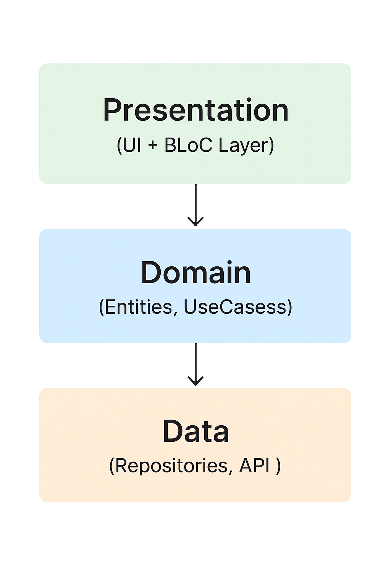

# Architecture

This application follows a **feature-first Clean Architecture** pattern, where the codebase is organized primarily by feature (e.g., `auth`, `home`, `profile`) and each feature contains its own distinct layers — **Presentation**, **Domain**, and **Data**.

Within each feature, the code is separated into three main layers:

- **Data** — Handles API calls, local storage, and data models.
- **Domain** — Contains core business logic, entities, and use cases.
- **Presentation** — Includes UI code and state management.
  - When using the **BLoC** package, all BLoC classes (events, states, blocs/cubits) live in this layer, coordinating between UI and the domain layer.

This approach keeps concerns isolated, makes the codebase easier to navigate, and scales well as new features are added.

The architecture is strongly inspired by the [Flutter Guide to app architecture](https://docs.flutter.dev/app-architecture/guide).

---

## 📂 Example Structure

features/auth/
data/
models/
repositories/
domain/
entities/
repositories/
usecases/
presentation/
bloc/
auth_bloc.dart
auth_event.dart
auth_state.dart
pages/
login_page.dart
widgets/
login_form.dart

---

## 🔄 Data Flow Diagram
  ┌────────────────────┐
  │     Presentation    │
  │  (UI + BLoC Layer)  │
  └─────────┬───────────┘
            │
            ▼
  ┌────────────────────┐
  │       Domain        │
  │ (Entities, UseCases)│
  └─────────┬───────────┘
            │
            ▼
  ┌────────────────────┐
  │        Data         │
  │ (Repositories, API) │
  └────────────────────┘

- **UI** sends user actions to **BLoC**.
- **BLoC** calls **use cases** from the Domain layer.
- **Domain** uses **repositories** from the Data layer.
- **Data** fetches or stores data (API, local DB) and returns it up the chain.

---

## Benefits

- **Feature-first organization** makes it easier to locate all code related to a single feature.
- **Separation of concerns** keeps business logic independent from UI.
- **BLoC integration** allows predictable state management and easier testing.

